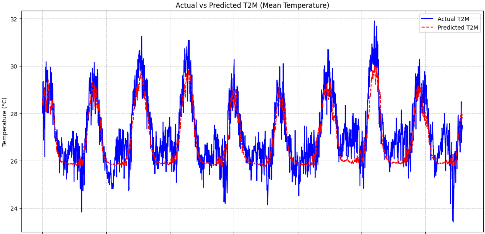
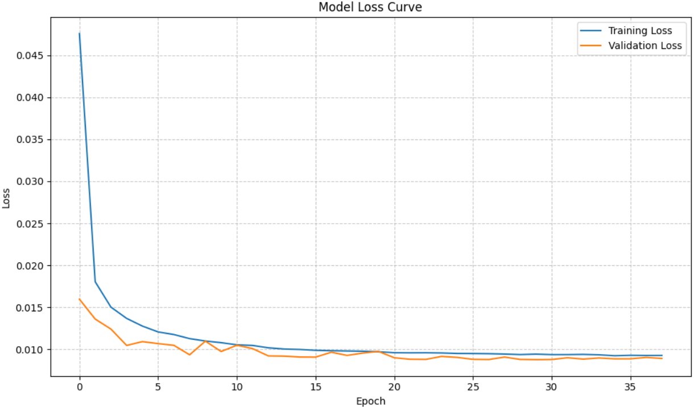
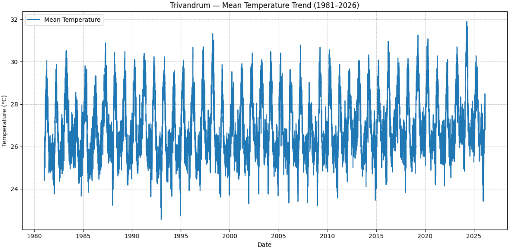
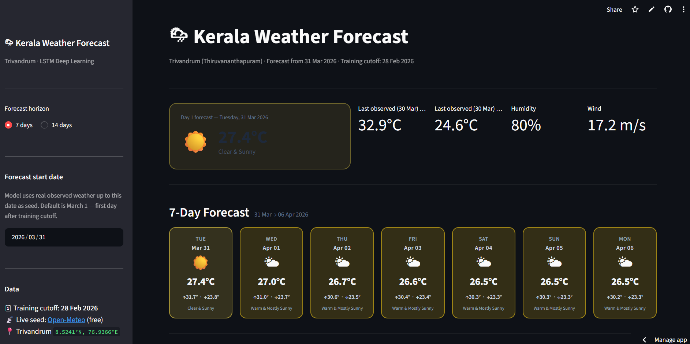
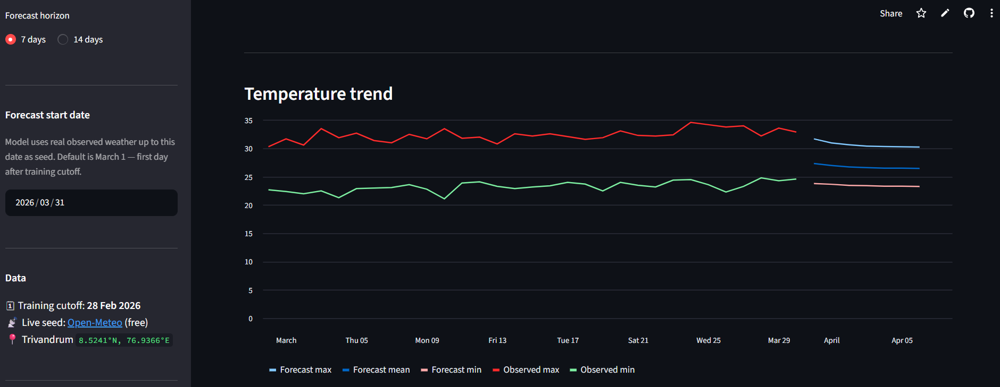

# 🌡️ Deep Learning-Based Temperature Forecasting for Trivandrum Using LSTM

## 📌 Project Overview

This project focuses on forecasting temperature in **Trivandrum, Kerala**, using a **Long Short-Term Memory (LSTM)** deep learning model.

Historical meteorological data covering approximately **45 years**, from **January 1, 1981 to February 28, 2026**, was obtained from **NASA POWER / MERRA-2**. The dataset contains multiple meteorological variables, including temperature, humidity, wind speed, radiation, atmospheric pressure, and precipitation-related parameters.

An LSTM-based time-series forecasting model was developed to learn temporal patterns from historical meteorological data. The trained model was integrated into an interactive **Streamlit application**, allowing users to generate and visualize temperature forecasts.

---

## 🎯 Objectives

* Analyze long-term meteorological data for Trivandrum, Kerala.
* Explore patterns and relationships among meteorological variables.
* Preprocess historical weather data for time-series forecasting.
* Develop an LSTM-based deep learning model for temperature forecasting.
* Evaluate model performance using regression metrics.
* Integrate the trained model into an interactive Streamlit application.
* Provide a user-friendly interface for temperature forecasting and visualization.

---

## 📊 Dataset

### Data Source

**NASA POWER / MERRA-2**

### Study Location

**Trivandrum, Kerala, India**

### Time Period

**January 1, 1981 – February 28, 2026**

### Dataset Characteristics

* Approximately **45 years of historical meteorological data**
* **35 meteorological features**
* Temperature and atmospheric variables
* Time-series observations used for model development

### Key Variables

The dataset includes meteorological variables such as:

* `T2M` — Temperature at 2 meters
* `T2M_MAX` — Maximum temperature at 2 meters
* `T2M_MIN` — Minimum temperature at 2 meters
* Humidity-related variables
* Wind speed
* Radiation variables
* Atmospheric pressure
* Precipitation/rainfall variables

---

## 🛠️ Technologies Used

| Category           | Technologies                    |
| ------------------ | ------------------------------- |
| Programming        | Python                          |
| Data Processing    | Pandas, NumPy                   |
| Data Visualization | Matplotlib, Seaborn             |
| Machine Learning   | Scikit-learn                    |
| Deep Learning      | TensorFlow / Keras              |
| Model              | LSTM                            |
| Deployment         | Streamlit                       |
| Development        | Jupyter Notebook / Google Colab |
| Version Control    | Git / GitHub                    |

---

## 🔄 Project Pipeline

The overall workflow of the project follows:

```text
Historical Meteorological Data
            ↓
       Data Collection
            ↓
        Data Cleaning
            ↓
Exploratory Data Analysis
            ↓
    Feature Preparation
            ↓
     Data Preprocessing
            ↓
      Feature Scaling
            ↓
   Time-Series Sequencing
            ↓
       LSTM Model
            ↓
     Model Training
            ↓
    Model Evaluation
            ↓
    Model Serialization
            ↓
 Streamlit Application
            ↓
Temperature Forecasting
```

---

## 🧹 Data Preprocessing

The historical meteorological data was prepared for deep learning and time-series forecasting.

The preprocessing workflow included:

* Cleaning and preparing the historical weather data
* Handling missing or inconsistent observations
* Selecting relevant meteorological variables
* Preparing the target temperature variables
* Scaling numerical features
* Converting the time-series data into sequences suitable for LSTM input
* Preparing training and testing datasets

The processed data was transformed into the three-dimensional structure required by an LSTM network:

```text
(samples, time steps, features)
```

---

## 🧠 LSTM Model Architecture

An **LSTM (Long Short-Term Memory)** neural network was used to capture temporal dependencies and patterns within the historical meteorological data.

The model architecture consists of multiple LSTM layers followed by a dense layer:

```text
Input
  ↓
LSTM — 96 units
  ↓
LSTM — 48 units
  ↓
LSTM — 24 units
  ↓
Dense — 48 units
  ↓
Output
```

The model incorporates **Dropout** and **L2 regularization** as part of the model design.

### Model Configuration

* LSTM layers: **96 → 48 → 24 units**
* Dense layer: **48 units**
* Regularization: **Dropout + L2**
* Framework: **TensorFlow / Keras**

---

## 📈 Model Performance

The trained model was evaluated using the test dataset with multiple regression metrics.

### Final Model Results

| Metric       |   Training |    Testing |
| ------------ | ---------: | ---------: |
| **R² Score** | **0.8732** | **0.8628** |

### Test Set Metrics

| Metric       |      Value |
| ------------ | ---------: |
| **R² Score** | **0.8628** |
| **MAE**      | **0.7431** |
| **RMSE**     | **0.9597** |
| **MAPE**     | **2.704%** |

The model achieved a test **R² score of 0.8628**, with an **MAE of 0.7431**, **RMSE of 0.9597**, and **MAPE of 2.704%** on the evaluation data.

---

## 📊 Model Evaluation Visualizations

The project includes visualizations to analyze the model's performance and forecasting behavior.

### Actual vs Predicted Temperature



### Training and Validation Loss



### Temperature Trends



---

## 🌐 Streamlit Application

The trained LSTM model was integrated into an interactive **Streamlit web application**.

The application provides a user-friendly interface for interacting with the forecasting model and viewing temperature predictions.

### Application Features

* Interactive user interface
* Temperature forecasting
* Prediction visualization
* Integration with the trained LSTM model
* Easy-to-use forecasting workflow

---

## 📸 Streamlit Application Screenshots

Screenshots are included to demonstrate the deployed application's interface and forecasting functionality.

### 🖥️ Application Interface




### 📈 Forecast Visualization



---

## 🔮 Future Improvements

Potential future improvements include:

* Comparing LSTM performance with GRU and other time-series forecasting approaches
* Experimenting with different sequence lengths and model architectures
* Incorporating additional meteorological variables
* Exploring alternative deep learning architectures
* Improving forecasting performance for longer prediction horizons
* Deploying the application on a cloud platform

---

## 👩‍💻 Author

**Sherry Mol Shaji**

**MSc Statistics with Data Science**

[GitHub](https://github.com/Sherry66410) · [LinkedIn](https://www.linkedin.com/in/sherry-mol-shaji)

